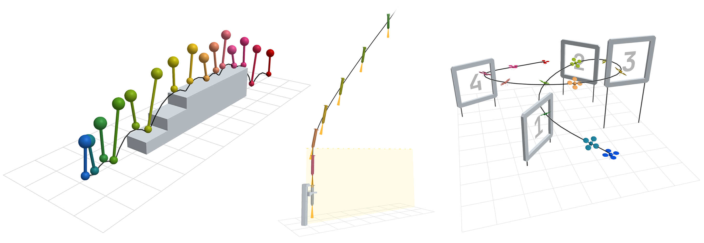
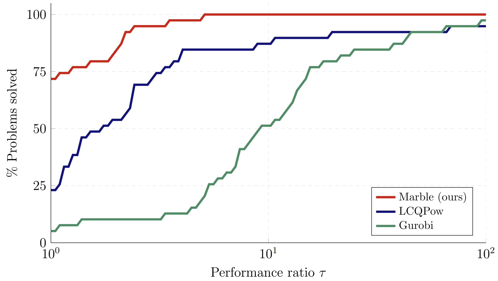

# Complementarity by Construction
<span class="subtitle">A Novel Approach to Solving Quadratic Programs with Linear Complementarity Constraints</span>
[Arun L. Bishop](https://www.linkedin.com/in/arun-bishop/), [Micah I. Reich](https://www.linkedin.com/in/micah-reich), and [Zachary Manchester](https://www.linkedin.com/in/zacmanchester/)



<!-- Marble is an open-source solver for quickly finding local solutions to quadratic programs with linear complementarity constraints (LCQPs). LCQPs are incredibly expressive, as shown by the examples above, but this comes at the price of non-convexity and disjoint feasible sets, making them challenging to solve. Given our view that LCQPs are as critical to reasoning about non-smooth or switching systems as QPs are critical to smooth optimization, we hope that this solver provides a useful tool to practically tackle them. -->

<div style="display: flex; gap: 0.5rem; justify-content: center; flex-wrap: wrap;" markdown="1">

[:fontawesome-solid-file-pdf: Paper](https://arxiv.org/abs/2604.11991){ .md-button .btn-academic target="_blank" }
[:fontawesome-brands-github: Code (coming soon)](#){ .md-button .btn-academic aria-disabled="true" tabindex="-1" role="button"}
<!-- [:simple-arxiv: arXiv](https://arxiv.org/abs/2604.11991){ .md-button .btn-academic target="_blank" } -->

</div>

# Abstract
Many problems in robotics require reasoning over a mix of continuous dynamics and discrete events, such as making and breaking contact in manipulation and locomotion. These problems are locally well modeled by linear complementarity quadratic programs (LCQPs), an extension to QPs that introduce complementarity constraints. While very expressive, LCQPs are non-convex, and few solvers exist for computing good local solutions for use in planning pipelines. In this work, we observe that complementarity constraints form a Lie group under infinitesimal relaxation, and leverage this structure to perform on-manifold optimization. We introduce a retraction map that is numerically well behaved, and use it to parameterize the constraints so that they are satisfied by construction. The resulting solver avoids many of the classical issues with complementarity constraints. We provide an open-source solver, Marble, that is implemented in C++ with Julia and Python bindings. We demonstrate that Marble is competitive on a suite of benchmark problems, and solves a number of robotics problems where existing approaches fail to converge.

# Background
## What is complementarity?
Complementarity constraints restrict two variables to be positive and mutually exclusive; one or the other is zero. Given scalars $s$ and $t$ this can be written as

$$\begin{align}s, \,\, t &\geq 0 \\  s \cdot t &= 0\end{align}$$

When $s$ and $t$ are vectors, $s \circ t = 0$ provides the element-wise exclusivity constraint, and the set of constraints is often written using the shorthand $0 \leq s \perp t \geq 0$. 

??? "Examples of Complementarity"
    === "Contact Dynamics"

        To model contact forces between rigid objects, we can write the following set of constraints:
        $$
        \begin{align}
        0 \leq f \perp d \geq 0
        \end{align}
        $$
        where $d$ is the signed distance between contact points and $f$ is the normal force exerted by one body on the other. Intuitively, this is enforcing that force-at-a-distance is not allowed: the contact force may only be nonzero if the objects are touching, i.e. if $d = 0$. 

    === "Inequality KKT Conditions"

        Consider an optimization problem of the form:

        $$\begin{align}\min_x \quad &f(x) \\ \text{subject to} \quad & g(x) \geq 0\end{align}$$

        The Karush-Kuhn-Tucker necesarry conditions for local optimality are given as:

        $$
        \begin{align}
        \nabla f(x) - \lambda \nabla g(x) &= 0 \tag{stationarity} \\
        0 \leq \lambda \perp g(x) &\geq 0 \tag{complementary slackness}
        \end{align}
        $$

        where $\lambda$ is the Lagrange multiplier associated with the inequality constraint $g(x) \geq 0$. 
        Intuitively, if the inequality is inactive, i.e. $g(x) > 0$, then $\lambda$ must be $0$ by the complementary slackness condition and therefore
        the objective gradient must be $0$. Otherwise, if $g(x) = 0$ at a locally optimal solution, we must have that $\nabla f$ and $\nabla g$ are parallel,
        meaning $f$ cannot be locally improved without stepping off the constraint.

## Relaxing Complementarity

<div style="display:flex; gap:2em; align-items:center;">
<div style="flex:1;">
The feasible set of \(0 \leq s \perp t \geq 0\) is a non-convex, \(L\)-shaped region. We can smooth this feasible set by instead requiring \(s \cdot t = \kappa\) for some \(\kappa > 0\). Examples of the original and relaxed feasible sets are shown to the right for varying \(\kappa\). 
<br><br>Notice that the relaxed complementarity feasible set for scalar \( s, t \in \mathbb{R} \) is a \(1\)-dimensional manifold which can be implicitly paramaterized. 
For scalars \( s, t \in \mathbb{R} \), we can satisfy relaxed complementarity by construction by choosing \( s = p_\kappa(\sigma) \) and \( t = p_\kappa(-\sigma) \) for a function \( p_\kappa \) which satisfies:
</div>
<div style="flex:1;">
-----8<----- "docs/plots/complementarity2.html"
</div>
</div>

$$
p_\kappa(\sigma) : \mathbb{R} \to \mathbb{R}^+ \quad \text{such that} \quad p_\kappa(\sigma) \cdot p_\kappa(-\sigma) = \kappa
$$

Using this paramaterization, we are guanteed to satisfy relaxed complementarity by construction **This implicit paramaterization underlies the methods used in our solver.**

!!! note "Choosing a Paramaterization \( p_\kappa \)"
    An easy-to-verify example of $p_\kappa$ is the exponential function $\sqrt{\kappa} e^x$ which clearly satisfies $\sqrt{\kappa} e^x > 0$ and $\sqrt{\kappa}e^x \cdot \sqrt{\kappa}e^{-x} = \kappa$. The exponential is not the only function with this property, and we found that the following retraction function is more numerically stable and has bounded gradients:

    $$
    p_\kappa(\sigma) = \frac{\sqrt{\kappa}}{2}\left(\frac{\sigma}{\sqrt\kappa} + \sqrt{\left(\frac{\sigma}{\sqrt\kappa}\right)^2 + 4}\right)
    $$

<!-- For an inequality constraint $g(x) \geq 0$ in an optimization problem, the Karush-Kuhn-Tucker conditions for local optimality includes the following
necesarry condition:
$$
\begin{align}
0 \leq \lambda \perp g(x) \geq 0
\end{align}
$$
where $\lambda$ is the Lagrange multiplier associated with the inequality constraint $g(x) \geq 0$. 
This condition says that if the inequality constraint is inactive, i.e. if $g(x) > 0$, then the 
Lagrange mutiplier associated with the constraint is $0$ -->

## Linear Complementary Quadratic Programs
Linear Complementary Quadratic Programs (LCQPs) extend standard QPs with linear complementarity constraints and are written using the following general form:

$$\begin{align}
    \min_{z, s, t} \quad &\frac{1}{2} z^TQz+g^Tz \\
    \text{subject to} \quad &Az + b = 0 \\
    &Cx + d \geq 0 \\
    &Lz + l = s \\
    &Rz + r = t \\
    &0 \leq s \perp t \geq 0
\end{align}$$

with the following problem data:

- $Q \in \mathbb{R}^{n_z \times n_z}$, $Q \succeq 0$ is the cost Hessian, and $g \in \mathbb{R}^{n_z}$ is the cost gradient
- $A \in \mathbb{R}^{n_e \times n_z}$ is the equality constraint jacobian, and $b \in \mathbb{R}^{n_e}$ is the equality constraint affine term
- $C \in \mathbb{R}^{n_i \times n_z}$ is the inequality constraint jacobian, and $d \in \mathbb{R}^{n_e}$ is the equality constraint affine term
- $L, R \in \mathbb{R}^{n_c \times n_z}$ are the complementarity constraint jacobians, and $l, r, s, t \in \mathbb{R}^{n_c}$ are the complementarity constraint affine terms and slack variables, respectivey

# Our Approach

Marble takes advantage of the available implicit paramaterization of the relaxed complementarity manifold to re-write the standard LCQP in relaxed, satisfied-by-construction form for a given $\kappa > 0$:

$$\begin{align}
    \min_{z, s, t} \quad &\frac{1}{2} z^TQz+g^Tz \\
    \text{subject to} \quad &Az + b = 0 \\
    &Cx + d \geq 0 \\
    &Lz + l = p_\kappa(\sigma) \\
    &Rz + r = p_\kappa(-\sigma)
\end{align}$$

The above optimization problem is referred to as a subproblem and is solved for a schedule of relaxation parameters $\kappa$ with $\kappa \to 0$. Each subproblem is solved using a standard Augmented Lagrangian-based method with a filter linesearch for globalization. Details on the solver implementation and derivation can be found in our paper.

## Results

We compare our solver against LCQPow, a penalty-SQP based method for solving LCQPs, and Gurobi, an industrial-grade MIQP solver. When using Gurobi, we transcribe complementarity constraints using a standard mixed-integer big-$M$ formulation of complementarity.

### MacMPEC Benchmark

The MacMPEC benchmarks contains a variety of complementarity problems from fields such as game theory, operations research, and structural dynamics. We solved the 39 MacMPEC problems that are LCQPs and compare against LCQPow and Gurobi. Our solver obtains feasible solutions for all problems and finds the global solution for 38 of 39 problems. LCQPow fails to achieve a complementarity tolerance less than $10^{-5}$ for one problem and finds the global solution for 33 problems. For every problem, our method achieves an equal or better solution compared to LCQPow. Additionally, Marble often outperforms LCQPow and Gurobi in solve time.

<figure markdown="span">
  { width="75%" }
</figure>

The plot above shows the performance profile of each solver, where $\tau$ is solve time for each problem scaled by the minimum solve time across the three solvers. 

### Trajectory Optimization Problems

We formulate and solve three robotics-specific problems chosen to demonstrate the capabilities of LCQPs to model a wide variety of systems and behaviors.

#### Progress Constraints
A quadrotor flies through racing gates with a specified completion order. Complementarity ties the switching of each gate completion indicator to trigger conditions that the quadrotor satisfies when it passes through each gate.
<video controls autoplay loop muted src="videos/progress_constraints.mp4" title="Progress Constraints"></video>

#### State-Triggered Constraints
A rocket with gimballed engines is guided into a catch tower. Complementarity actiavtes safety constraints to ensure the rocket stays in front of the catch tower and the engine points away from the tower when the rocket is within range.
<video controls autoplay loop muted src="videos/state_triggered_constraints.mp4" title="State-Triggered Constraints"></video>

#### Contact and Friction
A planar hopper traverses a raised platform with stairs. Complementarity models making and breaking contact, a no-slip condition, and the signed distance function of the staircase.
<video controls autoplay loop muted src="videos/contact.mp4" title="Contact and Friction"></video>

# Citing
If you use this work in your research, please cite it as follows:

```bibtex
@article{bishop2026complementarityconstructionliegroupapproach,
      title={Complementarity by Construction: A Lie-Group Approach to Solving Quadratic Programs with Linear Complementarity Constraints}, 
      author={Arun L. Bishop and Micah I. Reich and Zachary Manchester},
      year={2026},
      eprint={2604.11991},
      archivePrefix={arXiv},
      primaryClass={cs.RO},
      url={https://arxiv.org/abs/2604.11991}, 
}
```